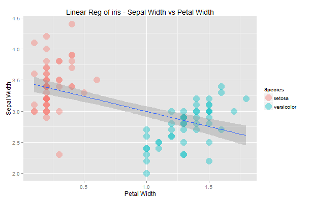
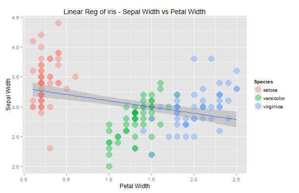
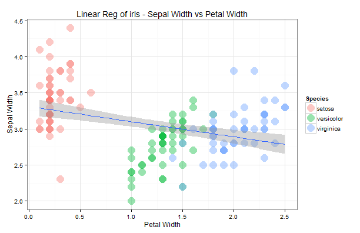

Deck Project for Coursera Course - Develop Data Products
========================================================
author: madlogos
date: Oct 21, 2015
transition: rotate
autosize: true

Introduction
========================================================
type: section

We have simultaneously created a Shiny app to show how widgets behave when users change settings on the app user interface.

- The checkbox group controls which Species to include in the calculation
- The dropdown box controls which theme to apply

Default View
========================================================
left: 45%

- In default, Species series `setosa` and `versicolor` were shown.
- Default theme 'theme_gray()' was applied

 

***

```
library(ggplot2)

data <- iris[iris$Species %in% c('setosa', 'versicolor'),]

ggplot(data,aes(x = Petal.Width, y = Sepal.Width))
+ geom_point(aes(color = Species), size = 6,alpha = 0.4)
+ stat_smooth(method = "lm", se = TRUE)
+ xlab("Petal Width") + ylab("Sepal Width")
+ ggtitle("Linear Reg of iris - Sepal Width vs Petal Width")
```


Select All the Species
========================================================
left: 45%

- Now select all series
- But theme was not changed

 

***

```
data <- iris

ggplot(data, aes(x = Petal.Width, y = Sepal.Width))
+ geom_point(aes(color = Species), size = 6, alpha = 0.4)
+ stat_smooth(method = "lm",se = TRUE)
+ xlab("Petal Width") + ylab("Sepal Width")
+ ggtitle("Linear Reg of iris - Sepal Width vs Petal Width")
```

Change A Theme
==========================================================
left: 45%

- Now change theme to `theme_bw()`
- But series were not changed

 

***

```
data <- iris

ggplot(data,aes(x = Petal.Width, y = Sepal.Width)) + theme_bw()
+ geom_point(aes(color = Species), size = 6, alpha = 0.4)
+ stat_smooth(method = "lm", se = TRUE)
+ xlab("Petal Width") + ylab("Sepal Width")
+ ggtitle("Linear Reg of iris - Sepal Width vs Petal Width")
```
