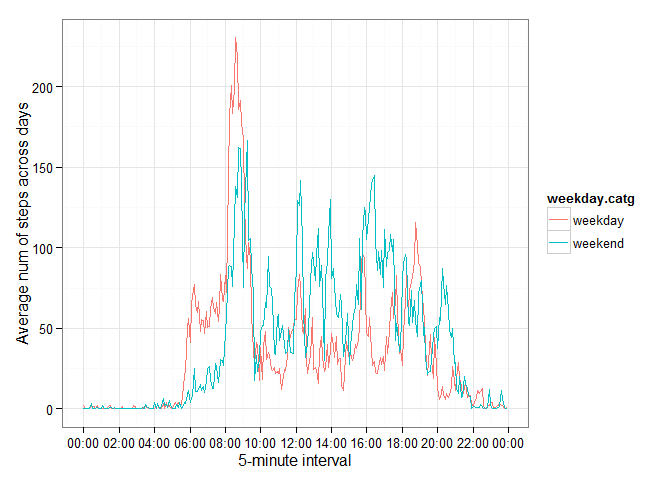

# Reproducible Research: Peer Assessment 1
## Background

Refer to https://github.com/madlogos/RepData_PeerAssessment1/blob/master/README.md on GitHub to this assignment.

## Loading and preprocessing the data

Set some global options first.


```r
knitr::opts_chunk$set(echo=T,results="asis",cache=T)
```

* We will download the zip file, unzip it and load the .csv file using `read.csv`.


```r
if (!file.exists("activity.zip")){
   download.file(url="https://d396qusza40orc.cloudfront.net/repdata%2Fdata%2Factivity.zip",destfile="activity.zip")
}
unzip("activity.zip")
data <- read.csv("activity.csv",header=T)
```

* Do some pre-processing. Transform the date from factor type to date type.


```r
data$date <- as.Date(data$date,"%Y-%m-%d")
```

## What is mean total number of steps taken per day?

* Make a histogram of the total number of steps taken each day.


```r
library(ggplot2)
q11 <- tapply(data$steps,data$date,sum,na.rm=T)
q11 <- as.data.frame(q11)
q11 <- data.frame("date"=as.Date(row.names(q11),"%Y-%m-%d"),
                  "steps"=q11[,1])
g11 <- ggplot(q11)+
    geom_histogram(binwidth=round((max(q11$steps)-min(q11$steps))/10,0),
                   aes(q11$steps),color="white",fill="deepskyblue")+
    theme_bw()+xlab("Total number of steps taken per day")+ylab("Freq")
print(g11)
```

 

* Calculate and report the mean and median total number of steps taken per day.


```r
q12 <- data.frame(mean=mean(q11$steps), median=median(q11$steps))
knitr::kable(q12,caption="Mean and median of total number of steps taken per day")
```


Table: Mean and median of total number of steps taken per day

    mean   median
--------  -------
 9354.23    10395

## What is the average daily activity pattern?

* Make a time series plot (i.e. type = "l") of the 5-minute interval (x-axis) and the average number of steps taken, averaged across all days (y-axis)


```r
library(scales)
q21 <- as.data.frame(tapply(data$steps,data$interval,mean,na.rm=T))
q21 <- data.frame(interval=as.numeric(row.names(q21)),avgstep=q21[,1])
q21$inv<-sprintf("%04d",q21$interval)
q21$time <- strptime(q21$inv,"%H%M")
g21 <- ggplot(q21,aes(x=time,y=avgstep))+
    geom_line(color="deepskyblue")+theme_bw()+
    xlab("5-minute interval")+
    scale_x_datetime(breaks=date_breaks("2 hours"),labels = date_format("%H:%M"))+
    ylab("Average num of steps across days")
print(g21)
```

 

* Which 5-minute interval, on average across all the days in the dataset, contains the maximum number of steps?


```r
q22 <- as.data.frame(q21[q21$avgstep==max(q21$avgstep),])
q22[,2]
```

     835 
206.1698 

```r
cat("\n","The 5-min interval,on average across all the days, ",
          "containing the maximum of number is interval ",
          rownames(q22[1,]),", which is **",
          format(q22[,4],"%H:%M"),"**",sep='')
```


The 5-min interval,on average across all the days, containing the maximum of number is interval 835, which is **08:35**

Seems that the typical pattern is taking steps during **8-9 AM** in the morning.

## Imputing missing values

* Calculate and report the total number of missing values in the dataset (i.e. the total number of rows with NAs)

The answer is there are **2304** NAs in the dataset.

* Devise a strategy for filling in all of the missing values in the dataset. The strategy does not need to be sophisticated. For example, you could use the mean/median for that day, or the mean for that 5-minute interval, etc.

* Create a new dataset that is equal to the original dataset but with the missing data filled in.

My algorithm is substitute the missing values with the mean for that same 5-minute interval. 


```r
q3<-merge(x=data,y=q21,by="interval",all.x=T)
q3$steps[is.na(q3$steps)]<-q3$avgstep[is.na(q3$steps)]
```

The newly created dataset is data.frame `q3`. There are now **0** NAs in the new dataset.

* Make a histogram of the total number of steps taken each day and Calculate and report the mean and median total number of steps taken per day. 


```r
library(ggplot2)
q31 <- tapply(q3$steps,q3$date,sum)
q31 <- as.data.frame(q31)
q31 <- data.frame("date"=as.Date(row.names(q31),"%Y-%m-%d"),
                  "steps"=q31[,1])
g31 <- ggplot(q31)+
    geom_histogram(binwidth=round((max(q31$steps)-min(q31$steps))/10,0),
                   aes(q31$steps),color="white",fill="deepskyblue")+
    theme_bw()+xlab("Total number of steps taken per day")+ylab("Freq")
print(g31)
```

 

Then calculate and report the mean and median total number of steps taken per day.


```r
q32 <- data.frame(mean=mean(q31$steps), median=median(q31$steps))
knitr::kable(q32,caption="Mean and median of total number of steps taken per day")
```


Table: Mean and median of total number of steps taken per day

     mean     median
---------  ---------
 10766.19   10766.19

* Do these values differ from the estimates from the first part of the assignment?

A: Both mean and median increases. It's expected to reduce the proportion of NAs without changing the distributin pattern too much. With missing values filled by grouped means, the measure grows, and distribution is more like normal distribution.

* What is the impact of imputing missing data on the estimates of the total daily number of steps?

A: The missing data filling methods help to run modelling, as many algorithm have rigirous requirements over proportion of NAs. 

## Are there differences in activity patterns between weekdays and weekends?

* Create a new factor variable in the dataset with two levels -- "weekday" and "weekend" indicating whether a given date is a weekday or weekend day.


```r
#use q3, since the missing have been filled
Sys.setlocale("LC_TIME", "C")
```

[1] "C"

```r
q3$wk<-weekdays(as.Date(q3$date))
q3$weekcat<-as.factor(ifelse(q3$wk %in% c("Saturday","Sunday"),
                        "weekend","weekday"))
#create a data.frame of avg steps by 5-min intervals across days, grouped by weekday/weekend
q41 <- as.data.frame(tapply(q3$steps,list(q3$interval,q3$weekcat),mean))
q41 <- data.frame(interval=as.numeric(row.names(q41)),
                 weekday=q41[,1],weekend=q41[,2])
q41$inv<-sprintf("%04d",q41$interval)
q41$timeslot <- strptime(q41$inv,"%H%M")
#demo of the data.frame q41
knitr::kable(q41[1:5,1:4],caption="First 5 rows of the new data.frame")
```


Table: First 5 rows of the new data.frame

 interval     weekday     weekend  inv  
---------  ----------  ----------  -----
        0   2.2511530   0.2146226  0000 
        5   0.4452830   0.0424528  0005 
       10   0.1731656   0.0165094  0010 
       15   0.1979036   0.0188679  0015 
       20   0.0989518   0.0094340  0020 

* Make a panel plot containing a time series plot (i.e. type = "l") of the 5-minute interval (x-axis) and the average number of steps taken, averaged across all weekday days or weekend days (y-axis). 


```r
library(reshape2)
q42 <- q41[,2:4]
q42 <- melt(q42,id.vars="inv",variable.name="weekday.catg")
q42$timeslot <- strptime(q42$inv,"%H%M")

g4 <- ggplot(q42,aes(x=timeslot,y=value))+theme_bw()+
    geom_line(aes(color=weekday.catg))
g4<-g4+xlab("5-minute interval")+
    scale_x_datetime(breaks=date_breaks("2 hours"),labels = date_format("%H:%M"))+
    ylab("Average num of steps across days")
print(g4)
```

 

The pattern of activity differs in weekdays and weekend. The peak is higher, and rises earlier, in weekdays than in weekends.
